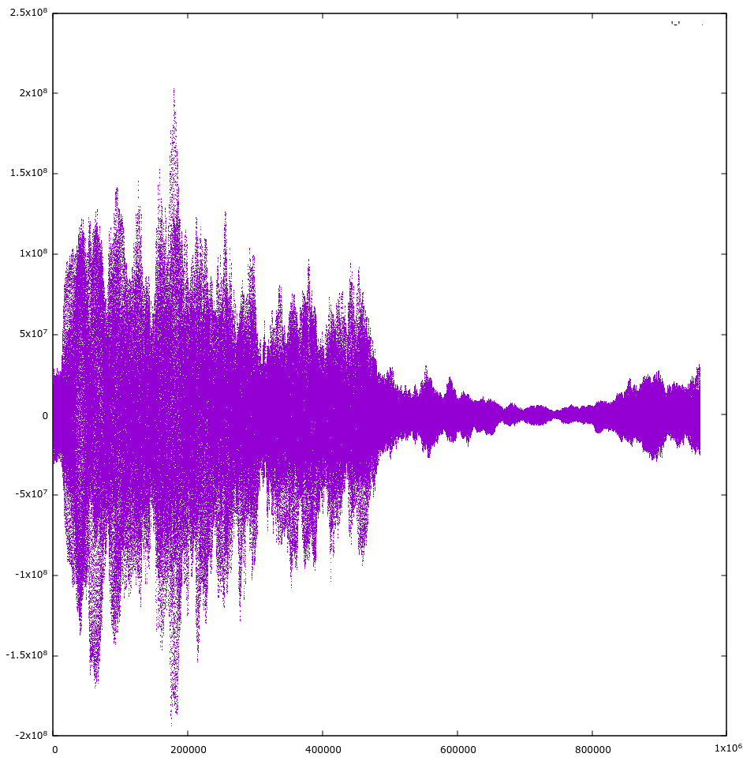

# Vidify Audiosync
[](https://travis-ci.com/vidify/audiosync)

This module is an extension for [vidify](https://github.com/marioortizmanero/spotify-music-videos). Its purpose is to synchronize the audio from 2 different sources: YouTube, and the currently playing audio on your computer. It's currently under development and only works on Linux (and macOS, but it's untested). In the future, Windows support will be added. Also, it's a separate module because it's an optional feature.


## Installation
The requirements are:

* [ffmpeg](https://www.ffmpeg.org/) (must be available in the user's path): a software suite to both download the song and record the system's audio. This dependency might be dropped in the future for `libav`, which is ffmpeg's main library and provides more control. Currently, the audio is obtained from a ffmpeg's pipe.
* [FFTW](http://www.fftw.org/): the fastest library to compute the discrete Fourier Transform (DFT), which is the most resource-heavy calculation made in this module.

You can install it with pip (preferably inside a [virtual environment](https://docs.python.org/3/tutorial/venv.html)):

`pip3 install .`

In the future, it will be available on the AUR and more sources.


## Usage
The only exported method is `get_lag(title: str)`, which returns the displacement between the two audio sources (positive or negative). `title` is the full YouTube link that the recorded audio will be compared to.

There are 2 apps to try:

* `apps/main.c`: used to debug more easily. You can run it with:

```shell
mkdir build
cd build
mkdir images
cmake ..
make
./apps/main "SONG NAME"
```

Use `-DCMAKE_BUILD_TYPE=Debug` to enable debugging and save plots into the images directory. You'll need `gnuplot` installed for that, and a directory named `images`.

* `apps/main.py`: the actual module usage. You can simply use `python main.py "SONG NAME"`


## How it works
*I'll try to explain it as clearly as possible, since this took me a lot of effort to understand without prior knowledge about the mathematics behind it. If someone with a better understanding of the calculations performed in this module considers that the explanation could be improved, please [create an issue](https://github.com/marioortizmanero/vidify-audiosync/issues) to let me know.*

The algorithm inside [src/cross\_correlation.c](https://github.com/marioortizmanero/vidify-audiosync/blob/master/src/cross_correlation.c) calculates the lag between the audio sources (a [cross-correlation](https://en.wikipedia.org/wiki/Cross-correlation)). This is used in many mathematical disciplines for different purposes, including [signal processing](https://en.wikipedia.org/wiki/Cross-correlation#Time_delay_analysis). The cross-correlation function describes the points in time where the signals are best aligned:



The graph above indicates that the provided signals are most likely to be aligned at the maximum point (at about ~18,000 frames, taking the absolute value of the function). To obtain this function, we use the [Discrete Fourier Transform](https://en.wikipedia.org/wiki/Fast_Fourier_transform), which determines the frequency content of the signal. Let `rfft` be the Fast Fourier Transform (an algorithm to calculate the DFT) in the real domain, `irfft` the Inverse Fast Fourier Transform in the real domain, and `conj` the conjugate of the imaginary results from the FFT, the formula is:

`irfft(rfft(signal1) * conj(rfft(signal2)))`

What we need is a [circular cross-correlation](https://en.wikipedia.org/wiki/Discrete_Fourier_transform#Circular_convolution_theorem_and_cross-correlation_theorem), because we don't know which track is the one that's delayed. For this, we have to fill both signals to size 2N with zeros before applying the formula. The lag found between the signals may actually be larger than the size of the signal itself (because it's circular), so rather than moving the second signal to the right to align them, we have to either move it to the left instead, or move the first signal to the right. The first signal is the audio recorded from the desktop and should not be moved, since the displacement is always be in respect to the recorded track, so this module will return a negative value instead.

After calculating the cross-correlation, we need a coefficient to determine how accurate the obtained results are, since the provided tracks could not be the same. The [Pearson correlation coefficient](https://en.wikipedia.org/wiki/Pearson_correlation_coefficient#For_a_sample) will return a value between -1 and 1, where 1 is total positive linear correlation, 0 is no linear correlation, and −1 is total negative linear correlation. What we are calculating is the positive linear correlation, so the closer this coefficient is to 1, the more accurately the signals are aligned. Knowing this, the module will return the first value that exceeds `MIN_CONFIDENCE` declared in the [src/global.h](https://github.com/marioortizmanero/vidify-audiosync/blob/master/src/global.h) file. To calculate this coefficient, we simply apply the formula found in the linked Wikipedia page.

Finally, the module will have returned the lag between the two audio sources if it's confident enough, or otherwise 0.

Another important part is the concurrency. Both audio sources have to be continuously downloaded and recorded while the algorithm is running every N seconds. This means that there are 3 main threads in this program:

* The main thread: launches and controls the download and capture threads, and runs the algorithm.
* The download thread: downloads the song with ffmpeg.
* The audio capture thread: records the desktop audio with ffmpeg.

To keep this module somewhat real-time, the algorithm is run in intervals. After one of the threads has successfully obtained the data in the current interval, it sends a signal to the main thread, which is waiting until both threads are done with it. When both signals are recevied, the algorithm is run. If the results obtained are good enough (they have a confidence higher than `MIN_CONFIDENCE`), the main thread sets a variable that indicates the rest of the threads to stop, so that it can return the obtained value.
